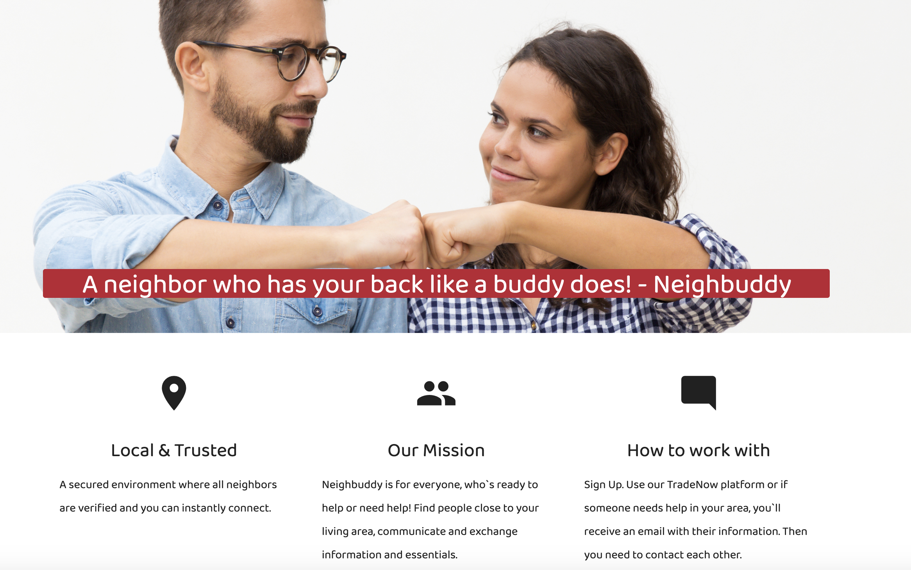

# NeighBuddy

## Developers

👤 **Kayla Bell**
👤 **Ilana Shaffer**
👤 **Milehna Mihneva**
👤 **Eric Licht**

⭐️ Star us on GitHub — it helps!

* Github: [Glowing-Octo-Garbanzo](https://github.com/kbell28k/glowing-octo-garbanzo)

[Neighbuddy](https://https://neighbuddy.herokuapp.com/).  acts as a trading platform for people in your neighborhood during quarantine. Developed out of COVID-19, it's a way to funnel resources throughout your community when they are in limited supply, or unable to be purchased.  The app will prompt users to provide information for upon sign-up/sign-in. The information given will allow users to post items within their posession they are willing to trade. In return other users may star / like / trade for posted items. 

## Table of Contents

- [Functionality](#Functionality)
    - [Sign-up/Sign-in](#typo3-extension-repository)
    
      - The user will register and login to the website with a email and password.The Passport package will allow users to log in with username and password, or other third party verifications such as Google. The password hashing middleware which we use to compliment Passport’s functionality is the Bcrypt package. This tool allows us to save the user in the database to later compare with the password used when generating their authentication token. Bcrypt adds 'salt' onto this concept by adding extra random characters onto the password that gets hashed. So the resulting hash is always different for the same input password. This prevents people from building a dictionary of hashes that corespond to the password that made them.
      
    - [Posting Page](#typo3-extension-repository)
      - Users will complete a form with their item information. Users will then post to the common page. The item data will post to the common page on a card that the others can view. The routes will allow all users to view the common page. Users can contact posters regarding items they'd like to exchange.   
      
    
    
    
- [Packages](#Packages)
    - [Node.js](#typo3-extension-repository)
      - Node.js is an open-source, cross-platform, JavaScript runtime environment that executes JavaScript code outside of a      browser.
    - [Sequelize](#typo3-extension-repository)
      - Sequelize is a promise-based ORM for Node.js. It has dozens of cool features like synchronization, association, and validation. It also has support for PostgreSQL, MySQL, MariaDB, SQLite, and MSSQL.
     
    - [Bcrypt](#typo3-extension-repository)
      - Bcrypt is a password hashing function. Besides incorporating a salt to protect against rainbow table attacks, bcrypt is an adaptive function: over time, the iteration count can be increased to make it slower, so it remains resistant to brute-force search attacks even with increasing computation power.
    - [Passport](#typo3-extension-repository)
      - Passport is authentication middleware for Node. js. Extremely flexible and modular, Passport can be unobtrusively dropped in to any Express-based web application. A comprehensive set of strategies support authentication using a username and password, Facebook, Twitter, and more.
    
    
 - [Database](#Packages)
    - [MySQL workbench](#typo3-extension-repository)
      - MySQL Workbench is a visual database design tool that integrates SQL development, administration, database design, creation and maintenance into a single integrated development environment for the MySQL database system.
      

